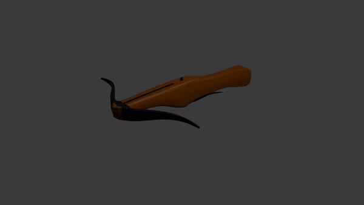

# The Lich King

The Lich King is a roguelike 3D game where the player controls a Witch Hunter. The player will have two different weapons at their disposal, chosen before each run. Each weapon will have a different attack style and thus, change the pace for the player.

Created by Gabriel Damasceno

## The Hub

During one of our classes, me and my other collegue, Gabriel, worked on the main hub for our game. The main hub is comprised of three areas:

 - The main island, where the player can test the combat and enter the dungeon;
 - The forge island, on the left, where the player can choose between the **Crossbow** and the **Blunderbuss**;
 - The magic island, on the right, where the player can unlock and then choose their upgrades.

<!-- 



 -->